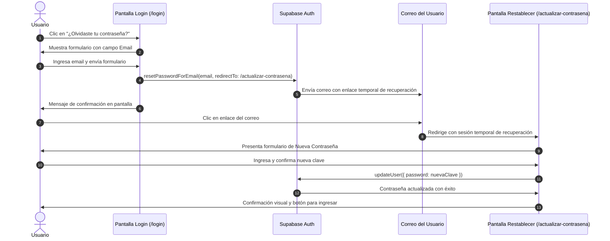

# Plan Técnico de Implementación — Spec 011: Recuperación y Restablecimiento de Contraseña

## 1. Arquitectura y Flujo de Autenticación Supabase

---

## 2. Capa de Servicios y Lógica (`src/lib/services/auth.ts`)
- Creación de servicio modular para autenticación:
  - `requestPasswordReset(supabase, email, redirectTo)`: encapsula el envío de correo de restablecimiento.
  - `updateUserPassword(supabase, newPassword)`: encapsula la actualización de contraseña.
  - `validatePassword(password, confirmPassword)`: función pura para validar longitud mínima (>= 6 caracteres) y coincidencia.

---

## 3. Capa de Rutas y Vistas (UI)

### 3.1 Actualización de `src/app/login/page.tsx`
- Extender el estado de vista a `mode: 'login' | 'register' | 'forgot_password'`.
- Agregar botón "¿Olvidaste tu contraseña?" en el formulario de login.
- En modo `forgot_password`:
  - Campo exclusivo para Correo Electrónico.
  - Botón interactivo "Enviar enlace de recuperación" con spinner de carga.
  - Alerta de éxito: *"Si el correo está registrado, te enviamos un enlace de recuperación. Revisa tu bandeja de entrada."*
  - Botón "¿Recordaste tu contraseña? Iniciar sesión".

### 3.2 Nueva Ruta `src/app/actualizar-contrasena/page.tsx`
- Vista pública con diseño Glassmorphism consistente con el ecosistema de la app:
  - Formulario con:
    - Campo "Nueva Contraseña" (mínimo 6 caracteres).
    - Campo "Confirmar Contraseña".
    - Botón "Guardar Contraseña".
  - Verificación de sesión o token en cliente mediante `supabase.auth.onAuthStateChange` / `supabase.auth.getSession()`.
  - Manejo de estados de error (enlace expirado, contraseñas no coincidentes).
  - Estado de éxito: mensaje verde y redirección al login o panel.

### 3.3 Revisión de `src/middleware.ts`
- Asegurar que la ruta `/actualizar-contrasena` sea reconocida como pública/de autenticación:
  - No redirigir a `/login` si no hay sesión inicial, permitiendo que el cliente Supabase capture los tokens de recuperación en el fragmento o URL.
  - Evitar que redirija a `/dashboard` si el usuario está en medio del proceso de reseteo.

---

## 4. Estrategia de Pruebas
1. **Pruebas Unitarias (Vitest)**:
   - Crear `src/lib/services/auth.test.ts` para verificar validaciones de contraseña y llamadas a Supabase.
2. **Pruebas E2E (Playwright)**:
   - Crear `e2e/auth-reset.spec.ts` para validar:
     - Navegación al modo "¿Olvidaste tu contraseña?" desde `/login`.
     - Renderizado y validaciones del formulario de `/actualizar-contrasena`.
